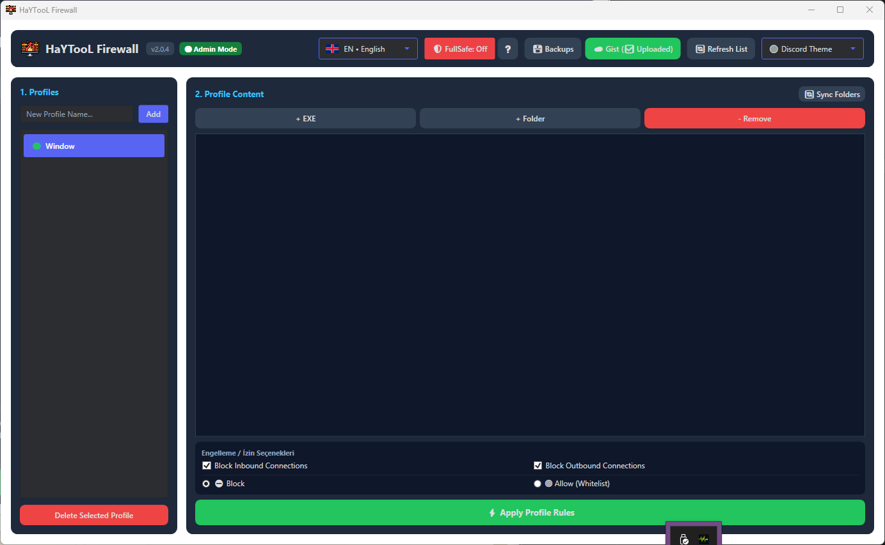

<p align="center">
  
</p>

<h1 align="center">🛡️ HaYTooL Firewall v2.0.6</h1>

<p align="center">
  <a href="#-english-en">🇬🇧 English Version</a> | <a href="#-türkçe-tr">🇹🇷 Türkçe Versiyon</a>
</p>

<p align="center">
  <a href="https://github.com/HaYToKoRaZ/HaYTooL-Firewall/releases/latest"></a>
  <a href="https://github.com/HaYToKoRaZ/HaYTooL-Firewall/releases/latest"></a>
  <a href="LICENSE"></a>
  <a href="https://github.com/HaYToKoRaZ/HaYTooL-Firewall/releases/latest"></a>
</p>

<p align="center">
  
  
  
  
</p>

<p align="center">
  
</p>

---

## 🇬🇧 English (EN)

### 📌 About The Project
**HaYTooL Firewall** is a modern, single-screen, lightweight Windows Firewall management dashboard built with .NET 10 & WPF. It allows you to organize firewall rules into profiles/categories, automatically blocking or allowing (whitelisting) thousands of `.exe` files in seconds with dynamic recursive folder scanning.

All profile configurations and settings are saved in a clean, human-readable **`HaYTooL_Firewall.ini`** file.

---

### ✨ Key Features
- **🛡️ Mandatory UAC Auto-Elevation:** Automatically requests and enforces Administrator privileges (`highestAvailable` + `runas` auto-relaunch) required for managing Windows Firewall rules.
- **🔄 Multi-Profile Dynamic Synchronization:** Scans all added folders across all profiles with one click. Automatically removes stale/orphaned firewall rules for deleted or renamed `.exe` files and applies updated rules.
- **🖼️ Real Shell & App Icon Extraction:** Displays genuine Windows shell icons and embedded application logos (`SHGetFileInfo` + `Icon.ExtractAssociatedIcon`) directly in the TreeView list for both folders and executables.
- **📁 Folder Executable Counter:** Displays real-time `.exe` file counts next to folder names in Panel 2 TreeView (e.g. `Games (12 EXE)`).
- **🛡️ FullSafe Mode & Whitelisting:** Enforces default-deny outbound network traffic across Windows while allowing selective whitelisting for trusted applications.
- **🌐 7 Languages (i18n):** Turkish, English, Spanish, German, Portuguese, Arabic, and Russian with instant live translations.
- **🎨 4 Premium Themes:** Modern Dark, Light, Discord, and YouTube design system themes.
- **💾 Local & GitHub Gist Cloud Backup:** Take instant local INI backups or sync your rules securely to your private GitHub Gist.
- **🔒 Single Instance Protection:** Prevents duplicate instances and brings the active window to the front.
- **🛡️ Privacy & Zero Telemetry:** 100% local, zero tracking, zero analytics. Personal Gist tokens are entered locally by the user and never hardcoded or shared.

---

### 🛠️ Build & Run
```bash
# Clone the repository:
git clone https://github.com/HaYToKoRaZ/HaYTooL-Firewall.git
cd HaYTooL-Firewall

# Build project:
dotnet build

# Publish standalone single-file EXE:
dotnet publish -c Release -r win-x64 --self-contained true -p:PublishSingleFile=true
```

---

## 🇹🇷 Türkçe (TR)

### 📌 Proje Hakkında
**HaYTooL Firewall**, Windows Güvenlik Duvarı kurallarını kategoriler (profiller) halinde düzenlemenize, binlerce `.exe` dosyasını saniyeler içinde özyinelemeli (recursive) klasör taraması ile engellemenize veya izin vermenize (whitelist) olanak sağlayan .NET 10 & WPF ile geliştirilmiş modern ve hafif bir masaüstü kontrol panelidir.

Tüm profil verileri ve ayarlar insanca okunabilir **`HaYTooL_Firewall.ini`** dosyasında saklanır.

---

### ✨ Öne Çıkan Özellikler
- **🛡️ Zorunlu UAC Yönetici Hakları:** Windows Güvenlik Duvarı kurallarını yönetmek için gerekli olan Yönetici Haklarını otomatik talep eder ve uygular (`highestAvailable` + `runas` otomatik yükseltme).
- **🔄 Tüm Profilleri Kapsayan Akıllı Senkronizasyon:** Tek tıkla tüm profillerdeki klasörleri tara. Adı değişen veya silinen `.exe` dosyalarının eski kurallarını otomatik kaldırır, güncel dosyaları işler.
- **🖼️ Gerçek Windows & Uygulama Simgeleri:** Hem klasörler hem de `.exe` dosyaları için Windows Shell ve uygulama amblem simgelerini (`SHGetFileInfo`) ağaç görünümünde (TreeView) canlı olarak görüntüler.
- **📁 Klasör EXE Sayacı:** Klasör isimlerinin yanında anlık kaç adet `.exe` içerdiğini gösterir (Örn: `Oyunlar (12 EXE)`).
- **🛡️ FullSafe Modu & Beyaz Liste (Whitelist):** Windows giden ağ trafiğini varsayılan olarak engelleyip sadece seçilen güvenli uygulamalara izin verme yeteneği.
- **🌐 7 Dil Desteği:** Türkçe, İngilizce, İspanyolca, Almanca, Portekizce, Arapça ve Rusça anlık canlı çeviri.
- **🎨 4 Premium Tema:** Modern Koyu (Dark), Açık (Light), Discord ve YouTube tasarım temaları.
- **💾 Yerel & GitHub Gist Bulut Yedekleme:** Yerel INI yedeği alma veya kurallarınızı kişisel gizli GitHub Gist hesabınıza şifreli senkronize etme.
- **🔒 Tek Çalışma Garantisi (Single Instance):** Çift çalıştırmayı engeller, açık pencereyi öne getirir.
- **🛡️ Gizlilik & Sıfır İzleme:** %100 yerel çalışma prensibi. Gist token bilgisi yerelde tutulur, hiçbir yere gönderilmez.

---

### 📄 Lisans
Bu proje [MIT Lisansı](LICENSE) altında lisanslanmıştır.
